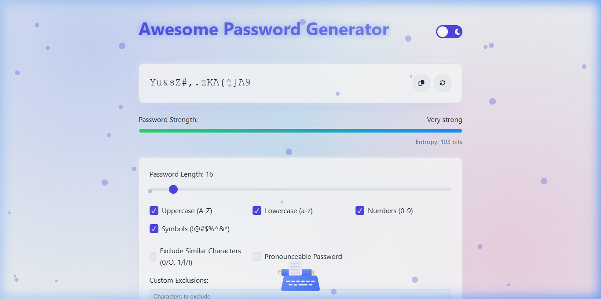
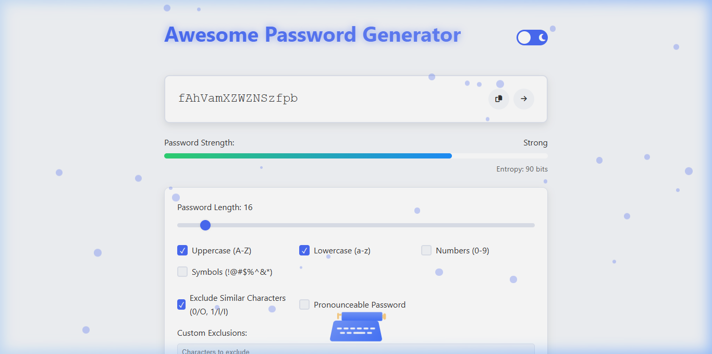

# 🔐 Awesome Password Generator

A state-of-the-art, feature-rich web application for generating cryptographically secure, high-entropy passwords and natural human-pronounceable passphrases with interactive visual effects and an animated typewriter widget.

---

## 🌟 Highlights & Visual Previews

### 1. Interactive Application & Middle-Bottom Animated Typewriter


### 2. Natural Phonetic Pronounceable Passwords


---

## ✨ Key Features

### 🛡️ Security & Cryptography
- **Unbiased CSPRNG:** Replaced floating-point modulo division with rejection sampling on `window.crypto.getRandomValues()` to eliminate modulo bias and maximize cryptographic entropy.
- **XSS-Proof Architecture:** Strict DOM node creation using `textContent` preventing HTML injection vulnerabilities.
- **Privacy Masking:** Password history supports one-click masking (`••••••••`) to prevent shoulder surfing, along with history clearing.
- **Strict Exclusion Integrity:** Guarantees mandatory category requirements (uppercase, lowercase, numbers, symbols) without re-introducing excluded characters (`excludeSimilar` or `excludeChars`).
- **Pattern & Repeat Defense:** Detects sequential characters (`123`, `abc`) and repeating patterns to protect against dictionary and brute-force attacks.

### 🔤 Natural Pronounceable Passwords
- **Phonetic Syllable Engine:** Generates natural human-friendly passphrases (e.g. `StarbonDraklin`, `BendorKrufal`, `FlamenGrin`) using 2-letter and 3-letter English syllables instead of awkward gibberish.
- **TitleCase Formatting:** Capitalizes word chunks automatically when Uppercase is enabled.

### 🎨 Design & Animations
- **Animated Typewriter Widget:** Positioned at the middle-bottom of the viewport, dynamically triggering active keypress animations whenever the user types into inputs or adjusts settings.
- **Dynamic Password Strength Bar:** Real-time color-coded strength bar with bit-level entropy calculation (`length * log2(pool_size)`).
- **Multiple Generation & Preset Templates:** Generate batches of passwords at once and save frequently used options as presets in `localStorage`.
- **Dark / Light Mode:** Built-in theme toggle with smooth CSS variable transitions.

---

## 📁 Project Structure

```
awesome-password-generator/
├── assets/                  # Screenshot previews and media assets
│   ├── app_preview.png
│   └── pronounceable_preview.png
├── css/
│   └── styles.css           # Modern design system, keyframes & typewriter widget styles
├── js/
│   ├── animations.js        # Visual effects, slot machine & matrix animations
│   ├── app.js               # Event handlers, safe DOM rendering & history management
│   └── password-generator.js# Unbiased CSPRNG, phonetic engine & strength evaluator
├── index.html               # Semantic HTML5 markup with ARIA accessibility tags
└── README.md                # Project documentation
```

---

## 🚀 Git Branch & Pushing Instructions

To create a new branch, commit your enhanced codebase, and push to your GitHub repository ([SURYAKNIGHT17/awesome-password-generator](https://github.com/SURYAKNIGHT17/awesome-password-generator)):

### Step 1: Create and Switch to a New Branch
Run the following command in your terminal:
```bash
git checkout -b feature/enhanced-security-typewriter
```

### Step 2: Stage Assets and Updated Files
```bash
git add .
```

### Step 3: Commit the Changes
```bash
git commit -m "feat: integrate interactive typewriter widget, fix security flaws, and improve pronounceable password engine"
```

### Step 4: Push the New Branch to GitHub
```bash
git push -u origin feature/enhanced-security-typewriter
```

---

## 💻 Technical Stack

- **HTML5:** Semantic layout with full ARIA accessibility (`aria-live="polite"`, `role="dialog"`).
- **CSS3:** Custom properties (CSS variables), keyframe animations, and flexbox/grid layout.
- **JavaScript (ES6+):** Object-oriented classes, Web Crypto API (`crypto.getRandomValues()`), and LocalStorage API.

---

## 📜 License

This project is open source and available under the [MIT License](LICENSE).
